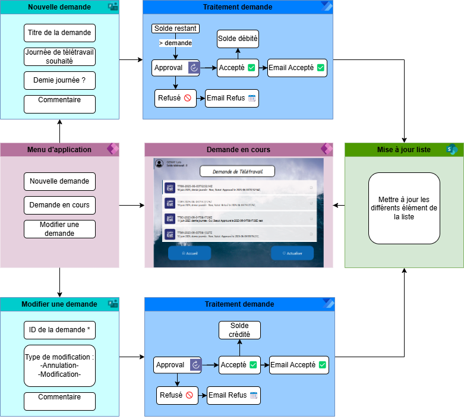
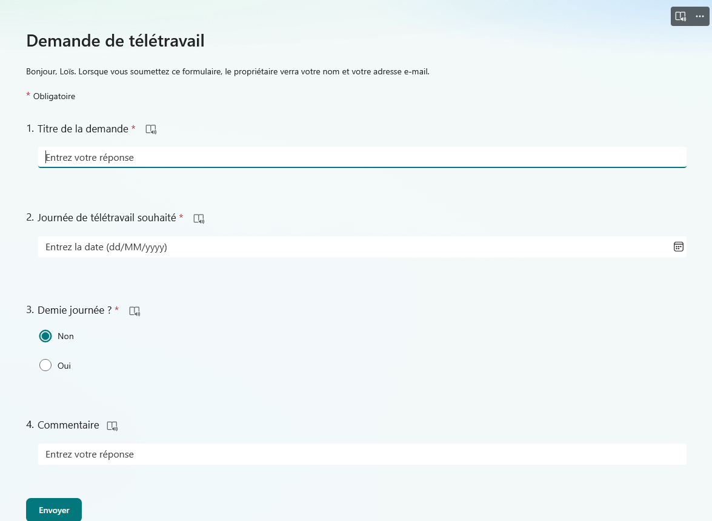
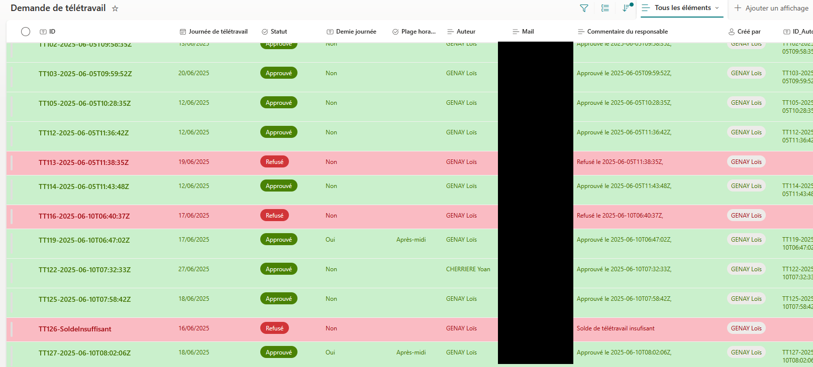
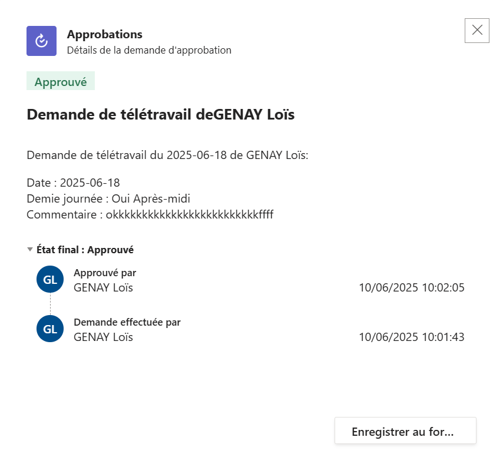

# Application de gestion du télétravail avec Power Platform

Ce projet a été réalisé dans le cadre de mon stage pour la Maison de région de nancy. L'objectif est de créer une solution complète permettant aux CMIL(agents) de demander du télétravail via un formulaire, de suivre leurs demandes et d'intégrer une validation hiérarchique automatisée via Teams et Outlook.

---

## 🧩 Technologies utilisées

- **Microsoft Forms** (formulaire initial)
- **SharePoint Online** (liste des demandes)
- **Power Apps** (interface utilisateur, visualisation et actions)
- **Power Automate** (workflow d'approbation avec notifications Teams/Outlook)
- **Teams & Outlook** (canaux de validation)

---

## 🔄 Fonctionnalités principales

- 📋 Demande de télétravail via Microsoft Forms
- ✅ Liste SharePoint isolée pour le CPCMIL (responsable)
- 🧭 Suivi des demandes dans une application Power Apps
- 🔁 Possibilité d’annulation ou modification d’une demande en cours
- 🔔 Système de validation via Power Automate avec carte d’approbation dans Teams et mail Outlook

---

## 🖼️ Aperçu visuel

| Formulaire | Liste SharePoint | Approbation Teams |
|-----------|------------------|-------------------|
|  |  |  |

---

## 🗂️ Structure technique

### Power Apps
- Galerie de suivi par utilisateur
- Composants pour modifier ou annuler une demande
- Écran dédié au responsable avec vue filtrée

### Power Automate
- Déclenchement sur ajout d’élément SharePoint
- Étape d’approbation avec `Start and wait for an approval`
- Notifications Teams (Adaptive Card) et mails Outlook

### SharePoint
- Liste avec colonnes personnalisées :
  - Demandeur
  - Date
  - Motif
  - Statut
  - Commentaires

---

## ⚠️ Données fictives

> Les captures et données sont **fictives ou anonymisées**. Ce projet a été adapté à des fins de démonstration.

---

## 🛡️ Licence

Ce projet est partagé sous licence **Creative Commons 0**. Voir le fichier [LICENSE](./LICENSE) pour plus d’informations.

---

## 📝 Avancement

- [x] Menu Power Apps (fichier .msapp)
- [x] Formulaire de demande Forms
- [ ] Flux Power Automate
- [x] Historique de demande utilisateur
- [x] Modification de demande
- [ ] Guide de déploiement pas à pas

